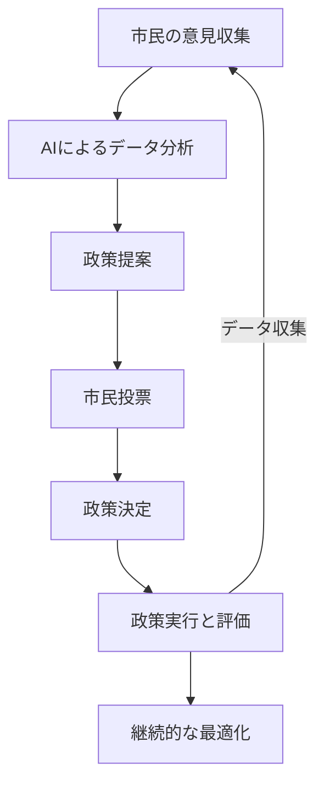

AI民主主義の仕組み – 新統合未来党

📀 AI民主主義とは？

AI民主主義は、AI・データ・ブロックチェーン技術を活用し、より透明で公正な政治システムを実現する新しい統治モデルです。従来の政治が抱える「利害関係の偏り」「不透明な意思決定」「市民の意見が反映されにくい」といった課題を、技術の力で解決します。

🟢 1. AI民主主義の基本構造

1️⃣ データ収集・市民の意見集約 🏟️

市民はデジタル投票やオンラインプラットフォームを通じて意見を提出。

SNSや政府統計などの公共データも収集し、AIが世論を分析。

ブロックチェーンにより、すべての投票データが透明に記録され、不正を防止。

2️⃣ AIによる政策提案・シミュレーション 🤖

AIが過去の政策データ・経済データ・環境データを分析し、最適な政策を提案。

例：「ベーシックインカムの導入が経済成長に与える影響」「環境税の効果」などをAIが予測。

政策ごとのリスク・メリット・デメリットを数値化し、市民に分かりやすく提示。

3️⃣ 市民投票＆意思決定 🏠

AIの提案をもとに、市民がデジタル投票で意思決定。

投票結果はブロックチェーンに記録され、改ざん不可能。

AIは「賛成派・反対派の意見」を分析し、新たな妥協案を提示することも可能。

4️⃣ 政策の実行と継続的な最適化 🔄

AIは政策の実行後、その効果をリアルタイムで分析し、必要に応じて改善提案。

透明な記録とデータ分析により、政策の失敗や汚職のリスクを最小限に抑える。

🟢 2. AI民主主義のメリット

💪 透明性の向上

すべての政策提案・投票データを公開し、市民が監視可能。

ブロックチェーンにより、意思決定の改ざんを防止。

💪 公正な政治

政治家の利害関係を排除し、データに基づいた最適な判断を実現。

AIがすべての市民の意見を平等に分析し、偏りのない政策を提案。

💪 政策の最適化

過去の成功例・失敗例を学習し、より良い政策を提案。

政策の効果をAIが継続的に分析し、改善を繰り返す。

💪 市民の意思が直接反映される

デジタル投票により、市民一人ひとりの意見が政策決定に影響。

AIが市民の意見を整理し、より分かりやすく政策提案を行う。

🟢 3. AI民主主義の実現ステップ

📅 第1段階（1〜5年） – 試験導入

地方自治体レベルでAI政策提案を試験運用。

政府データをオープン化し、透明性を向上。

市民が政策提案に参加できるAIプラットフォームを提供。

📅 第2段階（6〜15年） – 全国規模の実装

AI政策提案を法制化し、一部の政策分野で導入。

デジタル国民投票を試験的に実施し、市民の意思決定を拡張。

ブロックチェーンによる政策決定の記録を全国規模で導入。

📅 第3段階（16〜30年） – 国際連携とグローバル展開

主要国とAI民主主義ネットワークを構築し、国際協力を強化。

AIによる国際政策シミュレーションを導入し、各国の政策を最適化。

世界規模のデジタル投票と市民参加型統治を実現。

🟢 4. AI民主主義の全体の流れ（フローチャート）

🟢 5. まとめ

AI民主主義は、政治の透明性と公平性を高め、市民が直接意思決定に関与できる新たな政治システムです。データと技術の活用により、利害関係のない公正な政策決定が可能になり、社会全体の最適化が実現されます。

このシステムの導入により、誰もが政治に参加し、合理的な政策を選択できる未来が築かれます。

